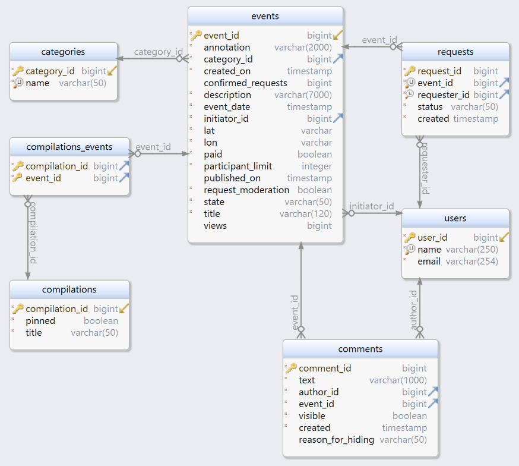

# ExploreWithMe.
Приложение — афиша, в которой можно предложить какое-либо событие и собрать компанию для участия в нём. Состоит из двух модулей: основного сервиса и сервиса статистики.

Стек:  **Java 11, Spring Boot, Maven, PostgreSQL, Hibernate, Docker, REST.**  

[Cпецификация API сервиса статистики приложения.](https://raw.githubusercontent.com/yandex-praktikum/java-explore-with-me/main/ewm-stats-service-spec.json)  
[Cпецификация API основного сервиса приложения.](https://raw.githubusercontent.com/yandex-praktikum/java-explore-with-me/main/ewm-main-service-spec.json)

ER-диаграмма БД приложения:
